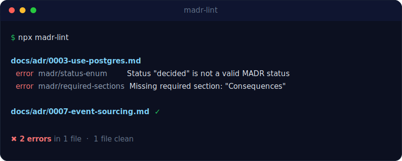

<div align="center">


<br>

[](https://www.npmjs.com/package/madr-lint)
[](https://github.com/knktkc/madr-lint/actions/workflows/ci.yml)
[](https://docs.npmjs.com/generating-provenance-statements)
[](LICENSE)
[](https://nodejs.org/)

**[Documentation](https://knktkc.github.io/madr-lint/)** ·
**[日本語ドキュメント](https://knktkc.github.io/madr-lint/ja/)** ·
[Getting started](https://knktkc.github.io/madr-lint/guides/getting-started/) ·
[Rules](https://knktkc.github.io/madr-lint/rules/)

<sub>For AI agents: [llms.txt](https://knktkc.github.io/madr-lint/llms.txt) indexes the docs; [llms-full.txt](https://knktkc.github.io/madr-lint/llms-full.txt) has the full text in one fetch; the [AI agents guide](https://knktkc.github.io/madr-lint/guides/ai-agents/) covers the ready-made [`adopt-madr-lint`](https://github.com/knktkc/madr-lint/blob/main/skills/adopt-madr-lint/SKILL.md) / [`new-adr`](https://github.com/knktkc/madr-lint/blob/main/skills/new-adr/SKILL.md) skills.</sub>

</div>

A fast, configurable linter for [MADR](https://adr.github.io/madr/) (Markdown Architectural Decision Records). It validates the things a plain Markdown linter can't: required sections, a valid status, ISO-8601 dates, filename convention, and cross-file integrity like unique numbering and non-broken links — across MADR **v2, v3, and v4**.

<div align="center">



</div>

## Why madr-lint

[MADR](https://github.com/adr/madr) ships no official linter, and the general-purpose tools each cover only part of what an ADR collection needs:

| Tool | Markdown style | Inter-doc links | ADR numbering | Status enum | Date format | Supersedes graph | v2 bold-list |
|---|:---:|:---:|:---:|:---:|:---:|:---:|:---:|
| [markdownlint-cli2](https://github.com/DavidAnson/markdownlint-cli2) | ✅ | — | — | — | — | — | n/a |
| [lychee](https://github.com/lycheeverse/lychee) | — | ✅ | — | — | — | — | n/a |
| [adrs (rust)](https://crates.io/crates/adrs) | — | — | ✅&nbsp;(init) | — | — | ~ | — |
| **madr-lint** | —¹ | ✅ | ✅ | ✅ | ✅ | ✅ | ✅ |

¹ Deliberately *not* Markdown style — pair it with `markdownlint-cli2` if you want both. `madr-lint` owns the ADR-specific semantics.

- **MADR v2 / v3 / v4 aware** — reads YAML frontmatter *and* v2 body-list metadata (both `- **Status**:` and canonical `* Status:`), or auto-detects per file.
- **ESLint-style rules** — named `madr/*` rules with `error` / `warn` / `off` and per-rule options validated by a JSON Schema.
- **Per-file & cross-file** — fast single-pass checks plus project rules for unique numbering, the supersedes graph, and link rot.
- **CLI, library & CI** — `text` / `json` / `sarif` / `github` reporters, a programmatic API, and a drop-in GitHub Actions step.
- **Gradual adoption** — [inline suppression comments](https://knktkc.github.io/madr-lint/guides/suppressing-rules/) for one-off exceptions and a [baseline file](https://knktkc.github.io/madr-lint/guides/adopting-existing-repo/) to snapshot legacy debt so only new violations fail the build.

## Install

```bash
npm install --save-dev madr-lint   # or: pnpm add -D madr-lint / yarn add -D madr-lint
```

Node.js 22+. ESM-only. Ships TypeScript types.

## Quick start

```bash
# Lint the configured adrDir (default: docs/adr)
npx madr-lint

# Explicit paths (files or directories; directories are searched recursively)
npx madr-lint docs/adr libs/x/adr

# Machine-readable output for CI
npx madr-lint --format sarif > madr-lint.sarif
```

Exit code: `0` clean · `1` on error-level diagnostics or an exceeded `--max-warnings` threshold · `2` on a config problem.

## Configure

A `madr-lint.config.ts` (or `.madrlintrc.json`) at your project root:

```typescript
import { defineConfig } from 'madr-lint';

export default defineConfig({
  extends: ['madr-lint:recommended'],
  madrVersion: 'auto',
  adrDir: 'docs/adr',
  ignorePatterns: ['**/template.md', '9999-*'],
  rules: {
    'madr/filename-format': ['error', { pattern: '^[0-9]{4}-.+\\.md$' }],
    'madr/no-numbering-gap': 'off',
  },
});
```

Rule values are a severity (`'error' | 'warn' | 'off'`) or a `[severity, options]` tuple. Options are validated — an invalid option fails fast with exit code `2`. Full reference: **[Configuration](https://knktkc.github.io/madr-lint/guides/configuration/)**.

## Rules

8 rules — 7 enabled by `recommended`, 1 opt-in. Each page documents its options, examples, and MADR-version compatibility.

| Rule | Type | Default | Checks |
|---|---|:---:|---|
| [`madr/required-sections`](https://knktkc.github.io/madr-lint/rules/required-sections/) | per-file | `error` | Required heading sections are present |
| [`madr/status-enum`](https://knktkc.github.io/madr-lint/rules/status-enum/) | per-file | `error` | `status` is one of the allowed values |
| [`madr/date-iso8601`](https://knktkc.github.io/madr-lint/rules/date-iso8601/) | per-file | `error` | `date` is a valid ISO-8601 calendar date |
| [`madr/filename-format`](https://knktkc.github.io/madr-lint/rules/filename-format/) | per-file | `error` | Filename matches the ADR convention |
| [`madr/no-broken-links`](https://knktkc.github.io/madr-lint/rules/no-broken-links/) | project | `error` | Relative links resolve to existing files |
| [`madr/no-duplicate-numbering`](https://knktkc.github.io/madr-lint/rules/no-duplicate-numbering/) | project | `error` | ADR numbers are unique |
| [`madr/supersedes-bidirectional`](https://knktkc.github.io/madr-lint/rules/supersedes-bidirectional/) | project | `error` | `supersedes` / `superseded-by` agree |
| [`madr/no-numbering-gap`](https://knktkc.github.io/madr-lint/rules/no-numbering-gap/) | project | `off` | ADR numbers are contiguous (opt-in) |

## Use in CI

`madr-lint` ships a composite GitHub Action that annotates the PR diff directly:

```yaml
# .github/workflows/adr-lint.yml
jobs:
  madr-lint:
    runs-on: ubuntu-latest
    permissions:
      contents: read
    steps:
      - uses: actions/checkout@v4
      - uses: actions/setup-node@v4
        with: { node-version: 22 }   # madr-lint requires Node ≥22
      - uses: knktkc/madr-lint@v0
        with: { path: docs/adr }
```

> The floating `v0` tag tracks the latest v0.x release; for stricter
> reproducibility, pin an exact tag like `@v0.3.0`.

Or run it via `npx` in any CI provider:

```yaml
      - uses: actions/setup-node@v4
        with: { node-version: 22 }
      - run: npx madr-lint
```

The `sarif` reporter integrates with GitHub code scanning — see **[GitHub Action](https://knktkc.github.io/madr-lint/guides/github-action/)**.

## Programmatic API

```typescript
import { runRulesOnFile, buildProjectFile, rules } from 'madr-lint';

const diagnostics = runRulesOnFile(
  [rules.requiredSections, rules.statusEnum],
  { path: '0001-x.md', content },
  { severity: 'error' },
);
```

Full surface: **[Programmatic API](https://knktkc.github.io/madr-lint/guides/api/)**.

## Pairs well with

`madr-lint` intentionally skips Markdown *style* — compose it:

```bash
markdownlint-cli2 'docs/adr/**/*.md'   # Markdown style
lychee 'docs/adr/**/*.md'              # external link rot
madr-lint docs/adr                     # ADR structure + inter-ADR links
```

## Status

**Alpha.** Self-dogfooded (this repo lints its own ADRs) and validated against an external repository. Until 1.0, treat each minor bump as potentially breaking; the 1.0 gate is adoption feedback.

## Contributing

Issues and PRs welcome. See [CONTRIBUTING.md](CONTRIBUTING.md) for the dev setup, rule-shape guide, and TDD/changeset workflow. The project dogfoods its own linter against its own ADRs in [`docs/adr/`](docs/adr/).

## License

[MIT](LICENSE) © t.kaneko
